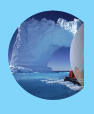
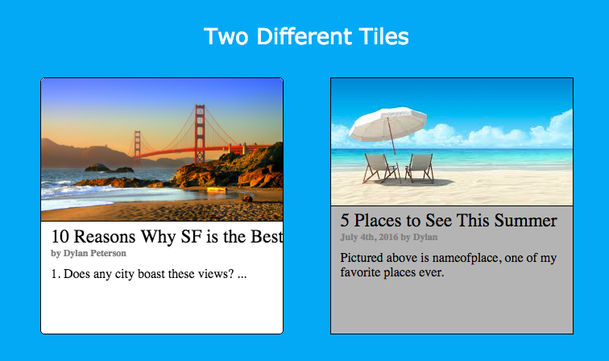
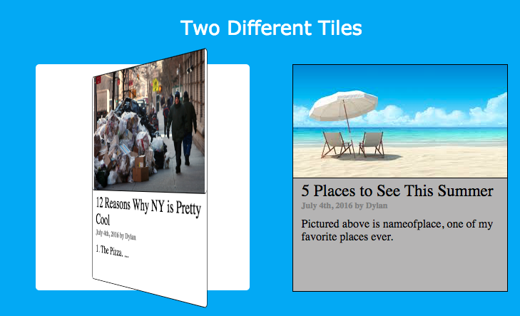
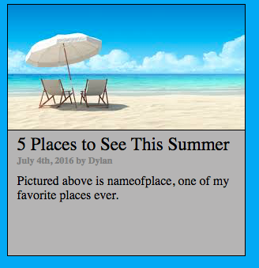
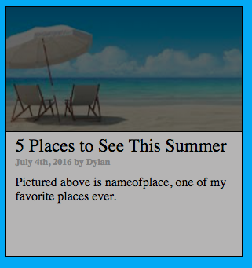

# Frontend Tricks

[FrontendTricks live][heroku]

[heroku]: https://dylanpeterson18.github.io/Frontend_Tricks/

Frontend Tricks is a frontend site written in JS, CSS, and HTML implementing some cool design features and functionality that I explored, including:

- Animate.css
- Vivus.js (Pathformer.js)
- Sticker.js
- Carousel.css
- Flipping Tiles
- Gradient Animation

## Gradient Animation
The header shifts from purple to blue every few seconds

blue

purple

## Vivus.js
###Draws SVGs
Beginning 

Middle 

End 

## Sticker.js
Images behave like real life stickers!

## Carousel.css
Images slide every few seconds and can be grabbed and moved fluidly with cursor and click controls

## Flipping Tiles
Tiles flip on hover to reveal more information

##Zooming Tiles
Tiles create zooming effect on hover

